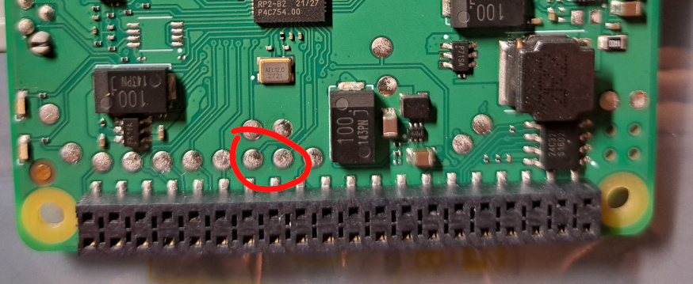

## Overview

The major hardware items are

- The RP2040 mcu
- 2 MB flash storage, WinBond W25Q16JV (the same component as that of the Pico board)
- The mysterious 44804 motor driver ICs (x4, with one for each of the 4 PowerUp ports)
- RPI compatible 40-pin header, which provides access to the serial port & a couple of GPIOs
- 2 LEDs
- SWD interface exposed as test points / soldering points


## Powering

There are two ways to supply power to the Build HAT. In the most common case, the power is supplied via the 7.5V DC connector. In this case, the Build HAT will also be able to supply power to the RPI via the 5V pin in the 40-pin header. The second way of supplying power, which is basically the opposite of the previous one, is through the 5V pin of the 40-pin header (to the Build HAT by the RPI for example). In this case, the Build HAT will only be sufficient to drive non-motor components, e.g. sensors.

## GPIO Assignment

In summary,

Func | GPIO     |   Description
-----|----------|-----------------
UART0   | 0, 1      | Accessible via the 40-pin header
I2C0    | 8, 9
I2C1    | 18, 19
Port 0  | 13, 12, 10, 11
Port 1  | 7, 6, 4, 5
Port 2  | 27, 26, 24, 25
Port 3  | 23, 22, 20, 21
LED     | 14 (red), 15 (green)
ADC     | 29        | As ADC input for VSYS sampling
|        | 17        | Port powering control
|       | 16        | Port powering check
|       | 28        | Motor powering check
GPIO    | 2, 3      | For general use, accessible via the 40-pin header


## 40-pin Header


With bottom side up:

```
                  G [39] [40]
                    [37] [38]
                    [35] [36] GPIO3
                    [33] [34] G
                    [31] [32]
                    [29] [30] G
            (ID_SD) [27] [28] (ID_SC)
                  G [25] [26]
                    [23] [24]
                    [21] [22]
                    [19] [20] G
    3v3 (ID_EEPROM) [17] [18]
   QSPI_CSn (BOOT0) [15] [16]
                    [13] [14] G
              GPIO2 [11] [12]
                  G [ 9] [10] GPIO0 (TXD)
                RUN [ 7] [ 8] GPIO1 (RXD)
                    [ 5] [ 6] G
                    [ 3] [ 4] 5v
           3v3 (NC) [ 1] [ 2] 5v
```


## SWD

The SWD interface is exposed as a pair of test points / soldering points, as marked below.



The marked soldering points, from left to right, lead to the swdio and swdclk pins, respectively.


## Lego PowerUp Connectors

Ref to https://philohome.com/wedo2reverse/connect.htm for the spec of PowerUp connectors.


The 6 pins of the connector can be illustrated as follows. 

```
    .---------------.   
    |               |
    |  6 5 4 3 2 1  |
    :_=^=^=^=^=^=^=_;
```

On the bottom side of the pcb, the 6 pins are located as 

```     
      (1) (3) (5)
        (2) (4) (6)
   --------------------
```

The pin definitions are: 

| Pin | Name | Func
|-----|-------|-------
| 1   | M1    | Motor power #1 (pwm)
| 2   | M2    | Motor power #2 (pwm)
| 3   | GND   |  
| 4   | VCC   | 3.3v
| 5   | ID1   | Analog id #1 / serial TX (hub -> device)
| 6   | ID2   | Analog id #2 / serial RX (device -> hub)


Asserting GPIO 17 high will enable powering of VCC (pin 4).

GPIO 16 & 28, with proper pull-up/-down, are believed to be read to check port and motor powering respectively. (I haven't quite figured out how to though.)

For each of the connectors, 4 GPIOs are assigned, with 2 connecting to the corresponding 44804 driver IC, and the other 2 connecting directly to ID1 & ID2 pins of the connector. In summary,

| Port 0 | Port 1 | Port 2 | Port 3 | Func
|--------|--------|--------|--------|-------
  13    | 7       | 27    | 23      | Motor driver (TBD)
  12    | 6       | 26    | 22      | Motor driver (TBD)
  10    | 4       | 24    | 20      | ID2
  11    | 5       | 25    | 21      | ID1


## I2C

RP2040 works as I2C masters, while 44804 driver ICs slaves

- I2C0 controlls ports 0 & 1, while I2C1 2 & 3
- Speed: 400,000 bps
- Slave addresses: 0x60, 0x68, 0x70, 0x78

See [the earlier section](#gpio-assignment) for GPIO assignments for I2C peripherals.

The 44804 driver ICs are described in detail in a [separate doc](./motor_driver.md). 


## USB

The USB device of RP2040 is not externally accessible.

## LED

Two LEDs are incorporated on the Build HAT, one red and the other green. The LEDs are active high.


## ID EEPROM

The Build HAT utilizes one OnSemi 24C32F as the ID EEPROM, located at the upper left corner of the pcb (next to the 40-pin header pin #37).

The EEPROM circuit is separate to the RP2040. 3v3 is required to power up the EEPROM circuit via pin #17 of the 40-pin header. 

Please note that pin #1 is N.C., aka not connected to pin #17 or the ID EEPROM circuit. 
