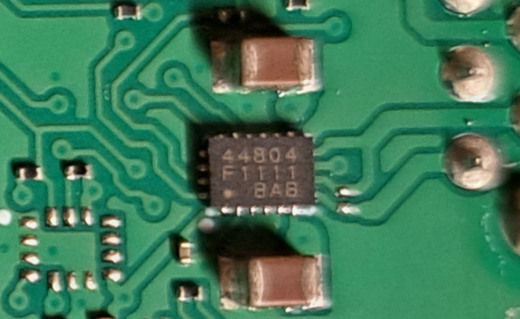

There is one motor driver IC, which has markings "44804 F1111 BAB" on the chip package, for each of the 4 PowerUp ports. 

AFAIK, there is no public available manufacturing or technical data for these "44804" chips.

The 44804 IC is controlled by an I2C master. The speed of the I2C communication is 400,000 bps. See also [the hardware doc](./bh_hw.md#i2c) for more details.

## Register Access

The state of the driver is organized as internal registers. Read or write to the registers to access the functionalities of the driver.

Each register is identified by a one-byte address. And the value of a register is also one byte in size.

To read one or more registers, write the base register address, then read one or more bytes, which are the register values. Therefore,

- To read register `a`, write `a` then read one byte
- To read the values of registers `a`, `a+1` and `a+2`, write `a` then read 3 bytes

Similarly, to write/modify one or more registers, write the base register address immediately followed by the value bytes. Hence

- To write register `a` with value `v`, write 2 bytes to the driver: `[a, v]`
- To modify registers `a`, `a+1` and `a+2` with values `v0`, `v1` and `v2` respectively, write 4 bytes: `[a, v0, v1, v2]`

## Register Difinitions

TBD.

## Functionalities

### Reset

Write `1` to register `0xf5`. 

It's advised to introduce a short delay (such as a few tens of milli-seconds) between reset and further register accessing.

### Initialize

The Build HAT firmware initializes the driver by the following register writing sequence: (the numbers are in hexadecimal)

  - 6a 00 
  - 6b 00 
  - 97 01 
  - 98 00 
  - 5c 20
  - 5d 03 
  - 9d 0e 
  - 18 3c 
  - 19 7a 
  - 1a 06 
  - 92 c5 
  - 15 f2 
  - 16 0b 
  - 21 44 
  - 2a be 
  - 2b 10 
  - 2c 10 
  - 42 c0 
  - 9a 20 
  - 6d 1e 
  - 09 03 
  - 0c 0f 
  - 0a 60 
  - 0d 60 
  - 70 6f
  - b6 09 
  - 4c 70 
  - 4c 7f

